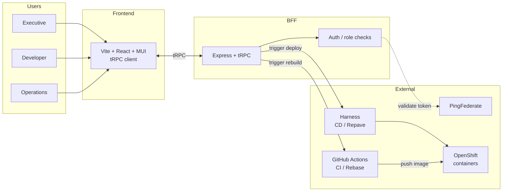
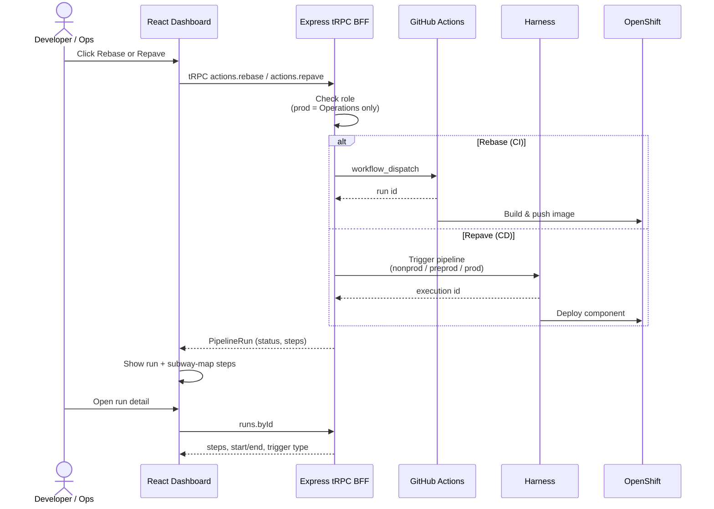
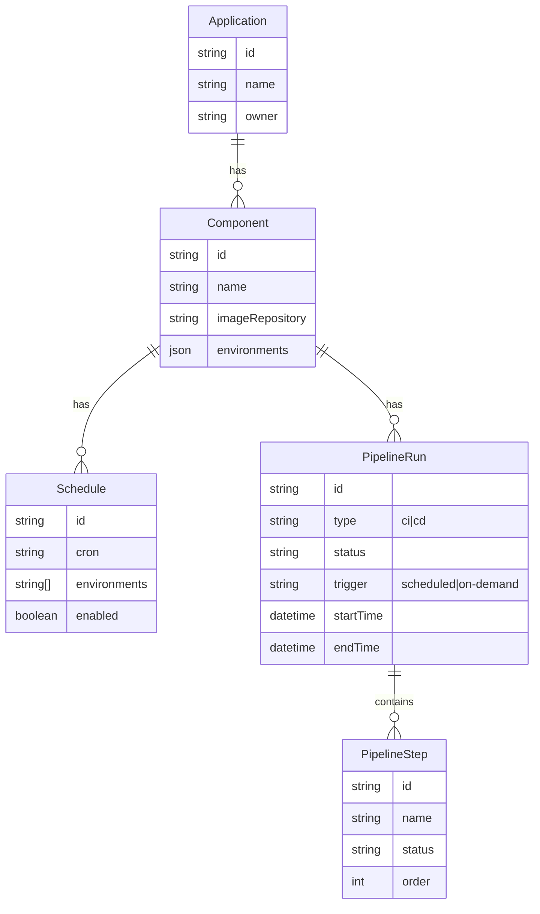

# LOB Dashboard

Monorepo for the Line of Business applications & components dashboard.

Users log in to view applications and their OpenShift-deployed components, trigger **Rebase** (CI / GitHub Actions image rebuild) and **Repave** (CD / Harness deploy), manage schedules, and inspect pipeline runs with a subway-map step view.

## Stack

| Layer | Tech |
|-------|------|
| Frontend | React 19 + Vite + TypeScript + MUI + Tailwind |
| BFF | Express + tRPC v11 |
| Auth | PingFederate (placeholder – mock tokens for local dev) |
| CI | GitHub Actions (Rebase) |
| CD | Harness (Repave) |
| Deploy target | OpenShift |
| Unit tests | Vitest |
| E2E tests | Playwright |

## Personas & permissions

| Role | View apps / runs | Manage schedules | Rebase | Repave nonprod / preprod | Repave **production** |
|------|------------------|------------------|--------|---------------------------|------------------------|
| Executive | ✅ | ❌ | ❌ | ❌ | ❌ |
| Developer | ✅ | ✅ | ✅ | ✅ | ❌ |
| Operations | ✅ | ✅ | ✅ | ✅ | ✅ |

## Architecture



## Request flow (Repave / Rebase)



## Domain model



## Project structure

```
dashboard-monorepo/
├── apps/
│   ├── web/                 # Vite React frontend
│   └── bff/                 # Express + tRPC BFF
│       └── src/
│           ├── routers/
│           │   ├── *.ts
│           │   └── *.test.ts      # Vitest unit tests
│           ├── mocks/
│           └── test/helpers.ts
├── e2e/                     # Playwright end-to-end tests
│   ├── helpers.ts
│   ├── dashboard.spec.ts
│   ├── applications.spec.ts
│   ├── runs.spec.ts
│   └── actions.spec.ts
├── packages/
│   └── shared/              # Shared domain types
├── Dockerfile               # Single-container build (UI + BFF)
├── docker-compose.yml
├── playwright.config.ts
├── vitest.config.ts
├── package.json
└── README.md
```

## Getting started

### Prerequisites

- Node.js 20+
- npm 10+ (bundled with Node)

### Install

```bash
cd dashboard-monorepo

# Optional: clean partial installs
rm -rf node_modules package-lock.json apps/*/node_modules packages/*/node_modules

npm install
```

### Run the app (two terminals)

**Terminal 1 – BFF**

```bash
npm run dev:bff
# or: npx tsx watch apps/bff/src/index.ts
```

| URL | Purpose |
|-----|---------|
| http://localhost:4000 | BFF |
| http://localhost:4000/trpc | tRPC endpoint |
| http://localhost:4000/health | Health check |

**Terminal 2 – Frontend**

```bash
npm run dev:web
# or: npx vite --config apps/web/vite.config.ts
```

Open **http://localhost:5173**.

### Switching roles (local dev)

Use the avatar menu (top-right), or in the browser console:

```js
localStorage.setItem('dev-role', 'operations') // executive | developer | operations
```

Refresh. The BFF accepts `Authorization: Bearer mock-<role>`.

| Role | Capabilities |
|------|----------------|
| `executive` | View only |
| `developer` | Rebase, Repave → nonprod / preprod, manage schedules |
| `operations` | Everything above + Repave → **production** |

## Scripts

| Command | Description |
|---------|-------------|
| `npm run dev:bff` | Start Express + tRPC BFF (watch mode) |
| `npm run dev:web` | Start Vite frontend |
| `npm run docker:build` | Build single-container image |
| `npm run docker:run` | Run image on port 4000 |
| `npm run docker:up` | `docker compose up --build` |
| `npm test` | Vitest unit / API tests (once) |
| `npm run test:watch` | Vitest watch mode |
| `npm run test:coverage` | Vitest with coverage |
| `npm run playwright:install` | Download Chromium for Playwright (first time) |
| `npm run test:e2e` | Playwright e2e suite (starts BFF + web automatically) |
| `npm run test:e2e:ui` | Playwright interactive UI mode |
| `npm run test:e2e:report` | Open last Playwright HTML report |

## Tests

### Unit / API (Vitest)

BFF routers are tested with **Vitest** using tRPC `createCaller` (no HTTP server required).

```bash
npm test
npm run test:watch
npm run test:coverage
```

| Area | What is asserted |
|------|------------------|
| **auth** | `me` / `session`; unauthenticated vs authenticated |
| **actions.rebase** | Developer & Ops allowed; executive forbidden; unknown component → NOT_FOUND |
| **actions.repave** | nonprod/preprod for developer; **production only for operations** |
| **runs** | List filters (type, status, component), byId, newest-first ordering |
| **applications / components** | List, byId, nested application |
| **schedules** | List, create, update; executive cannot create |

Test files: `apps/bff/src/routers/*.test.ts`  
Helpers: `apps/bff/src/test/helpers.ts`

### E2E (Playwright)

Browser tests under `e2e/`. Config starts BFF (`:4000`) and Vite (`:5173`) via `webServer`.

```bash
# First time only
npm run playwright:install

npm run test:e2e
npm run test:e2e:ui
npm run test:e2e:report
```

| Spec | Coverage |
|------|----------|
| `e2e/dashboard.spec.ts` | Home load, main navigation |
| `e2e/applications.spec.ts` | Apps list → application detail → component environments |
| `e2e/runs.spec.ts` | Runs list, type filters, run detail **subway map** |
| `e2e/actions.spec.ts` | Role-gated Rebase / Repave; production checkbox enabled only for Ops |

Roles are injected with `localStorage.setItem('dev-role', …)` before navigation so the BFF receives the matching mock bearer token.

## Key features

- Applications & components hierarchy
- Environment health (nonprod / preprod / production)
- Pipeline runs list with filters (CI/CD, status)
- Run detail with **subway-map** step visualization
- Rebase (CI) and Repave (CD) with role checks
- Schedules list (CRUD endpoints ready)
- Start/end time, duration, trigger type (scheduled vs on-demand)
- Unit tests (Vitest) and e2e tests (Playwright)

## Next integration points

1. **PingFederate** – replace mock token parsing in `apps/bff/src/lib/context.ts`
2. **GitHub Actions** – wire `actions.rebase` to `workflow_dispatch`
3. **Harness** – wire `actions.repave` to pipeline trigger API
4. **OpenShift** – live component status from the cluster API
5. Real-time run updates (polling, WebSocket, or SSE)

## Optional: pnpm

```bash
corepack enable
pnpm install
pnpm dev:bff   # terminal 1
pnpm dev:web   # terminal 2
pnpm test
```

## Docker (single container)

One container runs **both** the React UI and the Express tRPC BFF. The BFF serves the built SPA and the API on the same port.

```bash
# Build
docker build -t lob-dashboard .

# Run
docker run --rm -p 4000:4000 lob-dashboard

# Or with Compose
docker compose up --build

# Or via npm
npm run docker:up
```

Open **http://localhost:4000**

| Path | Purpose |
|------|---------|
| `/` | React dashboard (SPA) |
| `/trpc` | tRPC API |
| `/health` | Health check |

Role switching still works via the avatar menu or:

```js
localStorage.setItem('dev-role', 'operations') // executive | developer | operations
```

### How it works

1. Multi-stage `Dockerfile` builds the Vite SPA → static files, and compiles the BFF with `tsc`.
2. Runtime image copies the compiled BFF + SPA into `/app/public`.
3. Express serves `/trpc` + `/health`, then static assets, then SPA fallback (`index.html`).
4. The frontend uses a **relative** `/trpc` URL so it talks to the same origin inside the container.

Local development is unchanged (two processes + Vite proxy). Docker is for a single-process / production-style run.
